<div align="center">


<br/>

<a href="https://git.io/typing-svg">
  
</a>

<br/><br/>


&nbsp;

&nbsp;

&nbsp;


</div>

---


## `⟨ 001 ⟩` &nbsp; WHO AM I

```python
#!/usr/bin/env python3
# ═══════════════════════════════════════════════════════════════
#   REZOSND.PY  —  Developer Identity Module  —  India 🇮🇳
# ═══════════════════════════════════════════════════════════════

class SouravND:
    name         = "Rehan Suman"
    alias        = "rezosnd"
    institution  = "KIIT University, Bhubaneswar"
    degree       = "B.Tech — Information Technology"
    location     = "India 🇮🇳"
    status       = "Turning caffeine into commits since day one"

    stack = {
        "languages"  : ["Python", "C++", "JavaScript", "TypeScript"],
        "web"        : ["React", "Node.js", "Express", "MongoDB", "Next.js"],
        "ai_ml"      : ["NLP", "Machine Learning", "TensorFlow", "OpenCV"],
        "robotics"   : ["PID Control", "ROS", "Embedded C", "Sensor Fusion"],
        "iot"        : ["Arduino", "Raspberry Pi", "MQTT", "Edge Computing"],
        "devops"     : ["Docker", "Git", "Linux", "CI/CD"],
    }

    quests = [
        "⚡  Merging AI with Embedded Systems",
        "🤖  Building autonomous robotic agents",
        "🌐  Crafting full-stack web experiences",
        "🧠  Exploring Large Language Models",
        "🛸  Pushing the edge of edge computing",
    ]

me = SouravND()
print(f"Hello, World. I am {me.alias} — let's build what doesn't exist yet.")
```


---

## `⟨ 002 ⟩` &nbsp; ANIMATED LANDSCAPE 🌄

<div align="center">

<!-- 
  SVG hosted in your repo at assets/landscape.svg
  Upload the landscape.svg file provided into: rezosnd/rezosnd/assets/landscape.svg
-->


> *"Any sufficiently advanced technology is indistinguishable from magic." — Arthur C. Clarke*

</div>


---

## `⟨ 003 ⟩` &nbsp; TECH ARSENAL

<div align="center">

### ⚡ Languages


### 🌐 Web & Frameworks


### 🤖 AI / ML / Robotics


### ⚙️ DevOps & Tools


### 🔌 Hardware & IoT


</div>


---

## `⟨ 004 ⟩` &nbsp; MISSION DOMAINS

<div align="center">
<table>
<tr>
<td width="50%" valign="top">

### 🤖 &nbsp; Robotics & Embedded
```
▸ PID Control Systems
▸ Sensor Fusion & Kalman Filters
▸ ROS (Robot Operating System)
▸ Embedded C / C++ Programming
▸ Real-time System Design
▸ Autonomous Navigation
▸ Motor Drivers & Actuators
```

</td>
<td width="50%" valign="top">

### 🧠 &nbsp; AI & Machine Learning
```
▸ Natural Language Processing
▸ Computer Vision with OpenCV
▸ Neural Network Architecture
▸ Model Training & Fine-tuning
▸ Edge AI Deployment
▸ Reinforcement Learning
▸ LLM Integration & Prompting
```

</td>
</tr>
<tr>
<td width="50%" valign="top">

### 🌐 &nbsp; Full-Stack Development
```
▸ MERN Stack Applications
▸ RESTful & GraphQL APIs
▸ Responsive UI / UX Design
▸ Database Architecture
▸ Authentication & Security
▸ Cloud Deployment & CI/CD
▸ Microservices Architecture
```

</td>
<td width="50%" valign="top">

### ⚡ &nbsp; IoT & Edge Systems
```
▸ Arduino & Raspberry Pi
▸ MQTT Protocol & Messaging
▸ Edge Computing & Inference
▸ Wireless Sensor Networks
▸ Firmware Development
▸ Smart System Prototyping
▸ RTOS & Bare-Metal Programming
```

</td>
</tr>
</table>
</div>


---

## `⟨ 005 ⟩` &nbsp; PERFORMANCE METRICS

<div align="center">


<br/><br/>


&nbsp;&nbsp;


<br/><br/>


</div>


---

## `⟨ 006 ⟩` &nbsp; TROPHIES & ACHIEVEMENTS

<div align="center">


</div>


---

## `⟨ 007 ⟩` &nbsp; CONTRIBUTION GRID SNAKE 🐍

<div align="center">

<picture>
  <source media="(prefers-color-scheme: dark)"  srcset="https://raw.githubusercontent.com/rezosnd/rezosnd/output/github-contribution-grid-snake-dark.svg"/>
  <source media="(prefers-color-scheme: light)" srcset="https://raw.githubusercontent.com/rezosnd/rezosnd/output/github-contribution-grid-snake.svg"/>
  
</picture>

</div>


---

## `⟨ 008 ⟩` &nbsp; TOP CONTRIBUTIONS

<div align="center">


</div>


---

## `⟨ 009 ⟩` &nbsp; CURRENTLY EXPLORING

<div align="center">

```
┌──────────────────────────────────────────────────────────────────────┐
│                                                                      │
│   📡  Reading  :  Attention Is All You Need  (Vaswani et al.)       │
│   🔨  Building :  Autonomous Vision-Guided Robot with PID + CV      │
│   🧪  Learning :  Reinforcement Learning from Human Feedback        │
│   🌍  Goal     :  Open-source contributions to AI + Robotics        │
│                                                                      │
└──────────────────────────────────────────────────────────────────────┘
```

</div>


---

## `⟨ 010 ⟩` &nbsp; CONNECT WITH ME

<div align="center">

<a href="https://linkedin.com/in/rezosnd">
  
</a>
&nbsp;
<a href="https://instagram.com/rezosnd">
  
</a>
&nbsp;
<a href="https://reddit.com/user/rezosnd">
  
</a>
&nbsp;
<a href="https://codepen.io/rezosnd">
  
</a>
&nbsp;
<a href="https://quora.com/profile/rezosnd">
  
</a>
&nbsp;
<a href="https://facebook.com/rezosnd">
  
</a>

<br/><br/>


</div>


---

<div align="center">

```
╔═══════════════════════════════════════════════════════════════════╗
║                                                                   ║
║   "Any sufficiently advanced technology is indistinguishable     ║
║    from magic."  — Arthur C. Clarke                               ║
║                                                                   ║
║   🌌  Let's build the magic. One commit at a time.              ║
║                                                                   ║
╚═══════════════════════════════════════════════════════════════════╝
```


</div>
